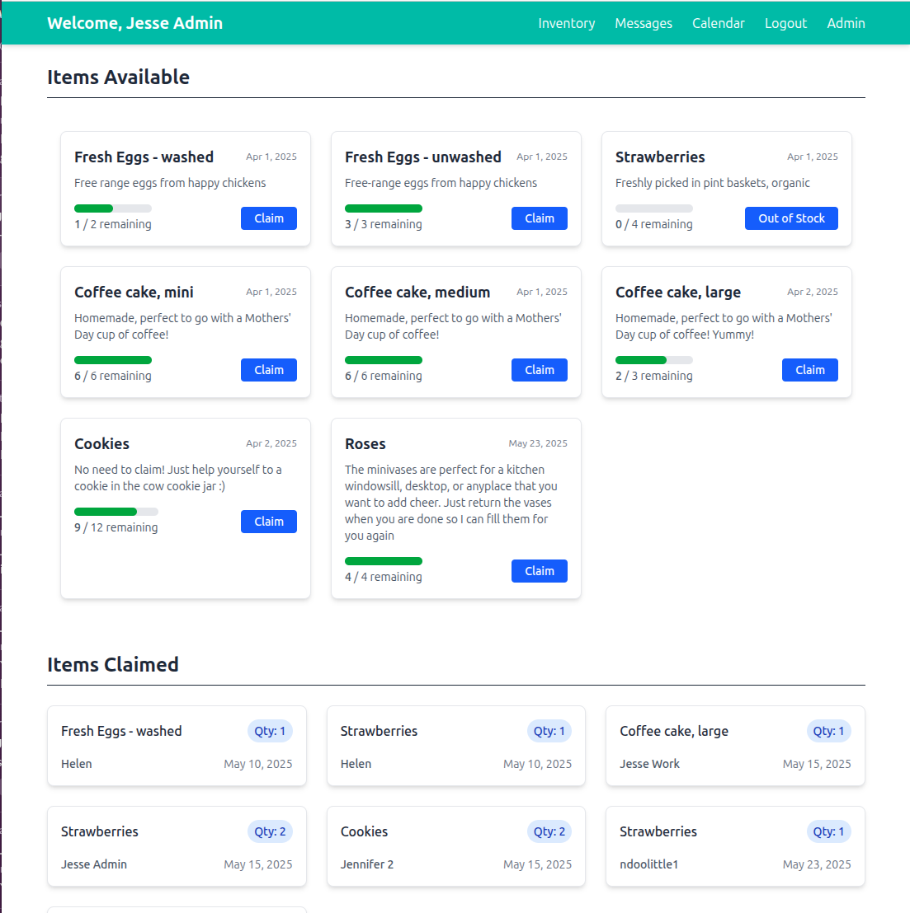
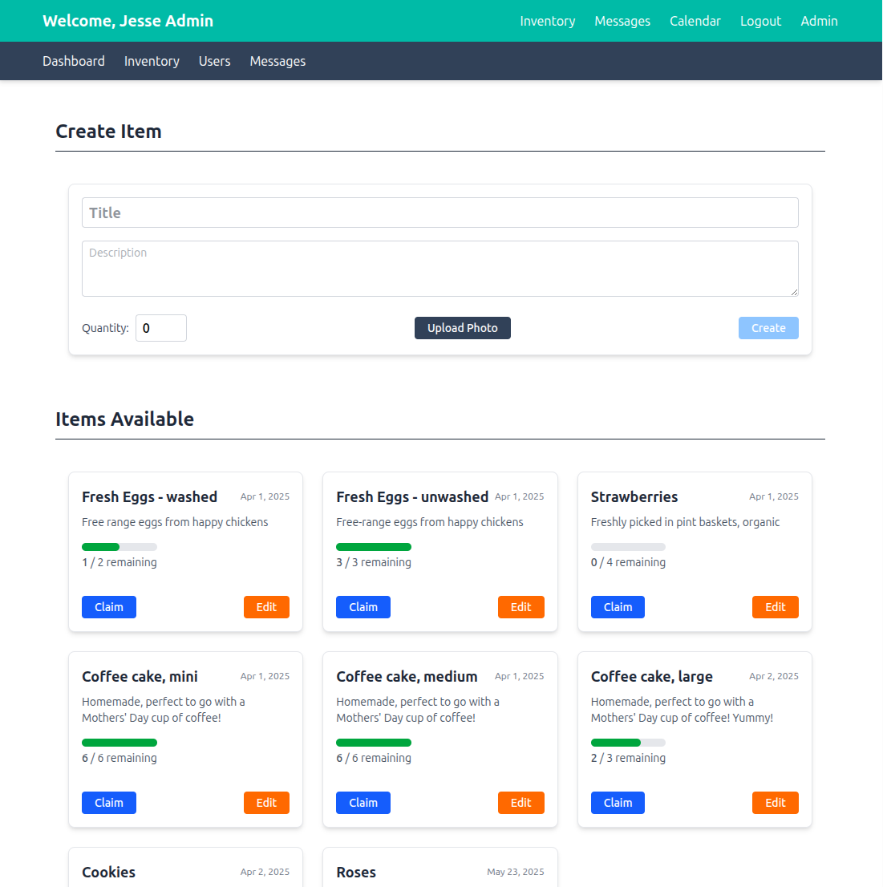

# 🌱 Farmsville

A friendly neighborhood tool for small-scale producers to manage and communicate with their local customers. Perfect for gardeners, small farmers, and backyard growers who want to sell fresh produce to their community.

## ✨ Features

- Customer management and communication
- Product listings and inventory tracking
- Order management
- Email notifications

| Customers                                        | Admin                                        |
| ------------------------------------------------ | -------------------------------------------- |
|  |  |

## 🚀 Quick Start

### Prerequisites

- Node.js (for frontend)
- Go 1.19+ (for backend)
- Gmail account with app password (for email features)

### Core Technologies

- **Frontend**: Svelte 5.0.0
- **Backend**: Gin 1.10.0 with air 1.61.7 (hot reloading)
- **Database**: SQLite 3.45.1 with GORM 1.25.12
- **Email**: Gmail SMTP

## 🔧 Development Setup

### 1. Email Configuration

Set up Gmail app password following [Google's guide](https://support.google.com/mail/answer/185833?hl=en), then:

```bash
cp .env.example .env
# Update .env with your Gmail credentials
```

### 2. Frontend Development

```bash
cd frontend
npm install
npm run dev
```

Frontend runs at `http://localhost:5173`

### 3. Backend Development

```bash
air
```

This creates a `data/` directory for the database and static files.

**Default login**: `admin@example.com` / `admin`

## 🐳 Docker Deployment

### Build and Run

```bash
# Build frontend
cd frontend && npm run build && cd ..

# Build for Linux
CGO_ENABLED=1 GOOS=linux GOARCH=amd64 CC="musl-gcc" go build -o main .

# Docker commands
docker build -t farmsville .
docker run -p 3000:3000 -v $(pwd)/data:/app/data --env-file .env farmsville
```

## 🤝 Contributing

We welcome contributions from the community! You'll notice a long list of issues. Here's how to get started:

### Development Process

1. **Fork** the repository
2. **Create** a feature branch: `git checkout -b feature/amazing-feature`
3. **Make** your changes
4. **Test** thoroughly (both frontend and backend)
5. **Commit** with clear messages: `git commit -m 'Add amazing feature'`
6. **Push** to your branch: `git push origin feature/amazing-feature`
7. **Submit** a Pull Request

### Code Standards

- Follow existing code style and conventions
- Add tests for new features
- Update documentation as needed
- Ensure all tests pass before submitting

## 🐛 Issues

Found a bug or have a feature request? We'd love to hear from you!

### Before Submitting

- **Search** existing issues to avoid duplicates
- **Check** if it's already fixed in the latest version
- **Test** with a fresh installation if possible

### Bug Reports

Please include:

- **Environment**: OS, browser, versions
- **Steps to reproduce** the issue
- **Expected vs actual behavior**
- **Screenshots** if applicable
- **Error messages** or console logs

### Feature Requests

Help us understand:

- **What** you'd like to see
- **Why** it would be useful
- **How** you envision it working
- **Use case** examples

### Issue Labels

- `bug` - Something isn't working
- `enhancement` - New feature or improvement
- `help wanted` - Good for contributors
- `good first issue` - Perfect for newcomers
- `documentation` - Documentation improvements

## 📄 License

This project is licensed under the MIT License - see the LICENSE file for details.
